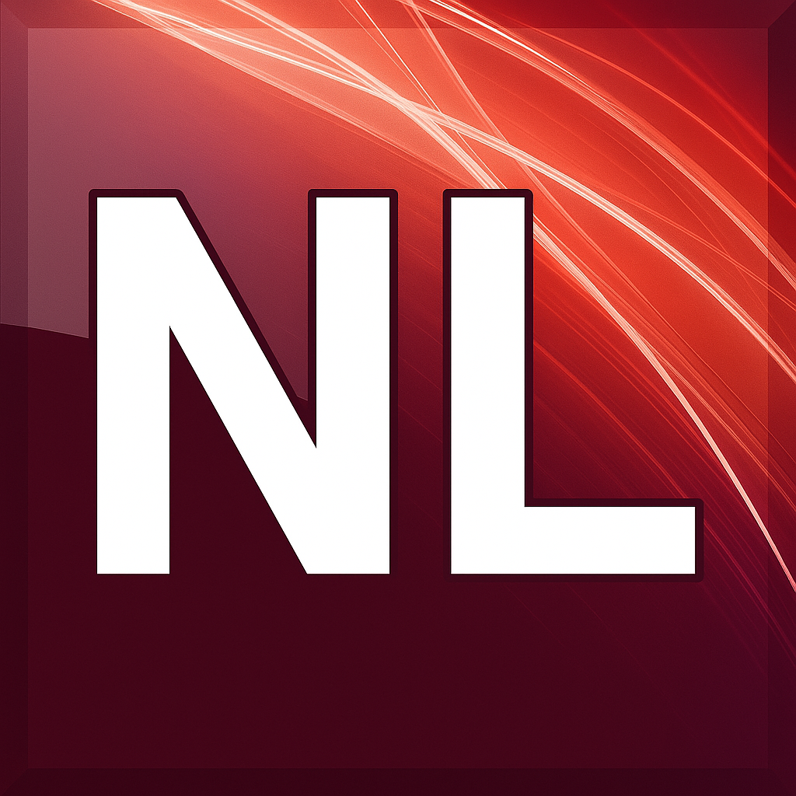

# netlinx-language-server

    

---

[![CI][ci]](https://github.com/Norgate-AV/netlinx-language-server/actions/workflows/ci.yml)

The `netlinx-language-server` is a Language Server Protocol (LSP) implementation for the NetLinx programming language. This project is currently under development.

[ci]: https://img.shields.io/github/actions/workflow/status/Norgate-AV/netlinx-language-server/ci.yml?logo=github&label=CI

## Contents :book:

<!-- START doctoc generated TOC please keep comment here to allow auto update -->
<!-- DON'T EDIT THIS SECTION, INSTEAD RE-RUN doctoc TO UPDATE -->

- [Team :soccer:](#team-soccer)
- [LICENSE :balance_scale:](#license-balance_scale)

<!-- END doctoc generated TOC please keep comment here to allow auto update -->

## Team :soccer:

This project is maintained by the following person(s) and a bunch of [awesome contributors](https://github.com/Norgate-AV/netlinx-language-server/graphs/contributors).

<table>
  <tr>
    <td align="center"><a href="https://github.com/damienbutt"> <b>Damien Butt</b></a> </td>
  </tr>
</table>

## LICENSE :balance_scale:

[MIT](./LICENSE)
